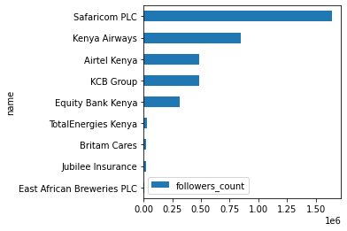
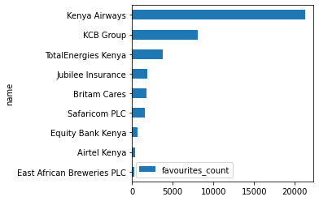
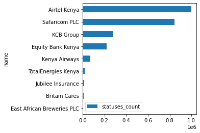

# Twitter Pages Analytics

We will use tweepy python library to analyze twitter pages information. To do that we install "tweepy" package using pip as illustrated below


```python
#Install the latest version of "tweepy" library
!pip install tweepy
```

    Requirement already satisfied: tweepy in c:\python310\lib\site-packages (4.3.0)
    Requirement already satisfied: requests-oauthlib<2,>=1.0.0 in c:\python310\lib\site-packages (from tweepy) (1.3.0)
    Requirement already satisfied: requests<3,>=2.11.1 in c:\python310\lib\site-packages (from tweepy) (2.26.0)
    Requirement already satisfied: idna<4,>=2.5 in c:\python310\lib\site-packages (from requests<3,>=2.11.1->tweepy) (3.3)
    Requirement already satisfied: certifi>=2017.4.17 in c:\python310\lib\site-packages (from requests<3,>=2.11.1->tweepy) (2021.10.8)
    Requirement already satisfied: charset-normalizer~=2.0.0 in c:\python310\lib\site-packages (from requests<3,>=2.11.1->tweepy) (2.0.7)
    Requirement already satisfied: urllib3<1.27,>=1.21.1 in c:\python310\lib\site-packages (from requests<3,>=2.11.1->tweepy) (1.26.7)
    Requirement already satisfied: oauthlib>=3.0.0 in c:\python310\lib\site-packages (from requests-oauthlib<2,>=1.0.0->tweepy) (3.1.1)
    

    WARNING: You are using pip version 21.2.3; however, version 21.3.1 is available.
    You should consider upgrading via the 'C:\Python310\python.exe -m pip install --upgrade pip' command.
    

You will have to get api keys, api secrets and authentication tokens from https://developer.twitter.com/ to be able to do these anaytics


```python
#Get the tweets in the timeline at the moment of the run
import tweepy

auth = tweepy.OAuthHandler(consumer_key, consumer_secret)
auth.set_access_token(access_token, access_token_secret)

api = tweepy.API(auth)

public_tweets = api.home_timeline()
for tweet in public_tweets:
    print(tweet.text)
```

    Magoha hints at the return of corporal punishment in schools https://t.co/RNJkZ9IWLJ
    RT @jensstoltenberg: Spoke with President @AndrzejDuda about the serious situation at #Poland’s border. #Belarus using migrants as a hybrid…
    RT @PLinNATO: President @AndrzejDuda spoke with #NATO Secretary General @jensstoltenberg about the crisis on the 🇵🇱-🇧🇾 border.
    NATO is clos…
    The Nakuru senatorial race has attracted a huge field of business magnates and government technocrats and promises… https://t.co/p753ixPt3x
    Tuvalu looking at legal ways to be a state if it is submerged https://t.co/P6zNtzc45u https://t.co/kHiXHov5VB
    Supreme Court judges decline to withdraw from BBI case, hearing set for January https://t.co/TeDOIfJMC9
    At times, I don’t understand logic &amp; narrative of CNN reports on Ethiopia. Their latest reporting is that Ethiopia… https://t.co/7n4WF8rJXf
    The Nakuru senatorial race has attracted a huge field of business magnates and government technocrats and promises… https://t.co/wfT3kTUQVz
    RT @TheAfricaReport: #Canada’s Osino Resources says average annual gold production at  #Namibia’s Twin Hills, from year two to year six, is…
    The latest local news updates on #K24DailyBrief https://t.co/hS6C0FP9ZC
    Find a river...
    Run by it
    #feelgood
    X https://t.co/PNjlN9wjQ8
    This is Ladies Might and our rhymes are tight, oh this is ladies might! We heard you, The Ladies’ Might 2 Motor Exp… https://t.co/MATo401UPE
    Denmark, which has one of Europe’s highest vaccination rates, plans to re-introduce some restrictions to halt a rec… https://t.co/mW0JWQWed4
    11:53 @KamauKiserian   What happened to Cytonn? via @kenyankorean
    Curry explodes for 50 as Warriors stay hot in NBA
    https://t.co/TGKs2MzbJK https://t.co/rnkMUr9Fj9
    Meeting a delegation from the Lower Eastern region at Chungwa House, Nairobi County. 
    
    #OneLove #Inawezekana https://t.co/y3bhfDGfUC
    The social media announcement sparked conservative backlash, including from Sen. Ted Cruz, who accused Big Bird of… https://t.co/eBYj6vcSsT
    Victims of crime could be left waiting for years for justice after Dominic Raab admitted he did not know how long i… https://t.co/VCZeE6tjps
    To Be Successful, Create Inertia https://t.co/S9n3cfSdHT
    3 children aged 7years, 2years and 10 months die in an inferno in Limuru
    
    https://t.co/jptcCoY0Vs https://t.co/cnhDYTaQUt
    

We will use Safaricom PLC official twitter page as our the first twitter user to inspect


```python
#Get the information from a twitter user  (In this case we will use Safaricom PLC twitter official page)
user = api.get_user(screen_name='@safaricomPLC')
```

Let's print the twitter user handle and the followers account


```python
#Get the basic information from the user
print(user.screen_name)
print(user.followers_count)

```

    SafaricomPLC
    1638741
    

Let's also print the top followers of the page


```python
#Print the top followers of the twitter page/user
for friend in user.friends():
   print(friend.screen_name)
```

    mohndirangu
    sireliaph
    Spanish50548739
    wickie02
    zakariyahji
    chinmobster
    ke_adolf
    mwmabonga
    KoshRoba
    2Jerrykinyua
    Nelsonbob1
    DennisKimai1
    JerryCollinsCJ
    McCarthyWebb1
    Kijanayangu
    oukekennedy
    Murim1Alex
    Kingsaayakenya1
    TAlwayo
    Eddotieno
    

Get additional information from the twitter user


```python
#Let's get some basic information about the page's info
print(user.verified) #If the user verified
print(user.location) #Location of user
print(user.screen_name) #Screen name
print(user.name) #name of user
print(user.followers_count) # The number of followers this account currently has. 
print(user.friends_count) # The number of users this account is following (AKA their “followings”)
print(user.listed_count)#The number of public lists that this user is a member of
print(user.favourites_count)#The number of Tweets this user has liked in the account’s lifetime.
print(user.statuses_count)#The number of Tweets (including retweets) issued by the user
print(user.created_at)#The UTC datetime that the user account was created on Twitter
print(user.profile_image_url_https)#A HTTPS-based URL pointing to the user’s profile image
print(user.url)#A URL provided by the user in association with their profile
print(user.id_str) #The string representation of the unique identifier for this User
print(user.description)#The user-defined UTF-8 string describing their account.
```

    True
    Kenya
    SafaricomPLC
    Safaricom PLC
    1638741
    78413
    588
    1542
    844146
    2010-02-26 08:28:15
    https://pbs.twimg.com/profile_images/1320977118969368577/afmPtoso_normal.jpg
    https://t.co/TGTa1s5IK2
    117685967
    The leading provider of converged communication solutions in Kenya. We're online 24/7 to serve you! Ask on @Safaricom_Care or #ChatWithZuri https://t.co/Piqm7EyVWW
    

## Analytics on top Kenyan companies' twitter handles
We will try and get insights from some top Kenyan companies' twitter handdles


```python
# Let's get this information for a list of top Kenyan companies twitter handles (Replace these with your own Twitter pages)
companies = ["@safaricomPLC","@KeEquityBank","AIRTEL_KE","@TotalEnergiesKE","@KCBGroup","@KenyaAirways","@EABL_PLC","JubileeInsKE","@BritamEA"]

#Create empty lists to store the information of the above 
screen_name = [];name = [];verified=[];location=[];followers_count=[];friends_count=[];listed_count=[];favourites_count=[]
statuses_count = [];created_at = []; profile_img_url=[];url = [];id_str=[];description=[]

#Create a loop to store the different tweet info of the pages above
for i in companies:
    user = api.get_user(screen_name=i)
    
    #Extract information from the twitter user
    screen_name.append(user.screen_name)
    name.append(user.name)
    verified.append(user.verified)
    location.append(user.location)
    followers_count.append(user.followers_count)
    friends_count.append(user.friends_count)
    listed_count.append(user.listed_count)
    favourites_count.append(user.favourites_count)
    statuses_count.append(user.statuses_count)
    created_at.append(user.created_at)
    profile_img_url.append(user.profile_image_url_https)
    url.append(user.url)
    id_str.append(user.id_str)
    description.append(user.description)

#Create a dictionary using the lists    
tweet_dict = {'screen_name':screen_name, 'name':name, 'verified':verified,'location':location,
             'followers_count':followers_count, 'friends_count':friends_count,'listed_count':listed_count,
             'favourites_count':favourites_count, 'statuses_count':statuses_count, 'created_at':created_at,
             'profile_img_url':profile_img_url, 'url':url, 'id_str':id_str, 'description':description}

#Use pandas to convert the dictionary to a pandas dataframe
import pandas as pd

tweet_df = pd.DataFrame.from_dict(tweet_dict)

#View the top rows of the created dataframe
tweet_df
    
```


<div>
<style scoped>
    .dataframe tbody tr th:only-of-type {
        vertical-align: middle;
    }

    .dataframe tbody tr th {
        vertical-align: top;
    }

    .dataframe thead th {
        text-align: right;
    }
</style>
<table border="1" class="dataframe">
  <thead>
    <tr style="text-align: right;">
      <th></th>
      <th>screen_name</th>
      <th>name</th>
      <th>verified</th>
      <th>location</th>
      <th>followers_count</th>
      <th>friends_count</th>
      <th>listed_count</th>
      <th>favourites_count</th>
      <th>statuses_count</th>
      <th>created_at</th>
      <th>profile_img_url</th>
      <th>url</th>
      <th>id_str</th>
      <th>description</th>
    </tr>
  </thead>
  <tbody>
    <tr>
      <th>0</th>
      <td>SafaricomPLC</td>
      <td>Safaricom PLC</td>
      <td>True</td>
      <td>Kenya</td>
      <td>1638743</td>
      <td>78413</td>
      <td>588</td>
      <td>1542</td>
      <td>844148</td>
      <td>2010-02-26 08:28:15</td>
      <td>https://pbs.twimg.com/profile_images/132097711...</td>
      <td>https://t.co/TGTa1s5IK2</td>
      <td>117685967</td>
      <td>The leading provider of converged communicatio...</td>
    </tr>
    <tr>
      <th>1</th>
      <td>KeEquityBank</td>
      <td>Equity Bank Kenya</td>
      <td>True</td>
      <td>KENYA</td>
      <td>317622</td>
      <td>8530</td>
      <td>160</td>
      <td>714</td>
      <td>220021</td>
      <td>2012-11-05 08:10:55</td>
      <td>https://pbs.twimg.com/profile_images/139171587...</td>
      <td>https://t.co/GGQHtA8jWs</td>
      <td>927151099</td>
      <td>Official twitter page for Equity Bank Kenya – ...</td>
    </tr>
    <tr>
      <th>2</th>
      <td>AIRTEL_KE</td>
      <td>Airtel Kenya</td>
      <td>True</td>
      <td>Kenya</td>
      <td>486746</td>
      <td>8684</td>
      <td>205</td>
      <td>366</td>
      <td>997591</td>
      <td>2010-09-17 08:50:27</td>
      <td>https://pbs.twimg.com/profile_images/783660189...</td>
      <td>https://t.co/uBs8x5assX</td>
      <td>191765987</td>
      <td>Get in touch. Speak from the heart. Seal the d...</td>
    </tr>
    <tr>
      <th>3</th>
      <td>TotalEnergiesKE</td>
      <td>TotalEnergies Kenya</td>
      <td>True</td>
      <td>Kenya</td>
      <td>31329</td>
      <td>1482</td>
      <td>26</td>
      <td>3761</td>
      <td>16112</td>
      <td>2012-08-07 08:01:08</td>
      <td>https://pbs.twimg.com/profile_images/140040961...</td>
      <td>https://t.co/K6WU4avlIH</td>
      <td>742426236</td>
      <td>TotalEnergies is a broad energy company that p...</td>
    </tr>
    <tr>
      <th>4</th>
      <td>KCBGroup</td>
      <td>KCB Group</td>
      <td>True</td>
      <td>East Africa</td>
      <td>484791</td>
      <td>21479</td>
      <td>225</td>
      <td>8040</td>
      <td>282117</td>
      <td>2010-10-10 20:11:48</td>
      <td>https://pbs.twimg.com/profile_images/111155295...</td>
      <td>https://t.co/qpf3uuxnuL</td>
      <td>200988657</td>
      <td>KCB Group is banking on you to be here for lif...</td>
    </tr>
    <tr>
      <th>5</th>
      <td>KenyaAirways</td>
      <td>Kenya Airways</td>
      <td>True</td>
      <td>Nairobi,Kenya</td>
      <td>850507</td>
      <td>7092</td>
      <td>1256</td>
      <td>21229</td>
      <td>71940</td>
      <td>2008-12-31 00:19:13</td>
      <td>https://pbs.twimg.com/profile_images/110508838...</td>
      <td>None</td>
      <td>18493366</td>
      <td>Africa's Leading Airline, The Pride Of Africa!</td>
    </tr>
    <tr>
      <th>6</th>
      <td>EABL_PLC</td>
      <td>East African Breweries PLC</td>
      <td>True</td>
      <td>Kenya</td>
      <td>8161</td>
      <td>36</td>
      <td>7</td>
      <td>269</td>
      <td>796</td>
      <td>2019-01-25 09:44:23</td>
      <td>https://pbs.twimg.com/profile_images/120540597...</td>
      <td>https://t.co/JXusK94i2H</td>
      <td>1088734316606251009</td>
      <td>Official EABL Page. Africa's leading branded a...</td>
    </tr>
    <tr>
      <th>7</th>
      <td>JubileeInsKE</td>
      <td>Jubilee Insurance</td>
      <td>True</td>
      <td>Nairobi, Kenya</td>
      <td>18869</td>
      <td>1035</td>
      <td>32</td>
      <td>1908</td>
      <td>15951</td>
      <td>2012-01-17 17:35:37</td>
      <td>https://pbs.twimg.com/profile_images/786207595...</td>
      <td>https://t.co/bcaSsUYf4S</td>
      <td>466680439</td>
      <td>Jubilee is the number one insurer in East Afri...</td>
    </tr>
    <tr>
      <th>8</th>
      <td>BritamEA</td>
      <td>Britam Cares</td>
      <td>True</td>
      <td>East &amp; Southern Africa</td>
      <td>25805</td>
      <td>1228</td>
      <td>66</td>
      <td>1802</td>
      <td>10317</td>
      <td>2010-11-04 08:09:45</td>
      <td>https://pbs.twimg.com/profile_images/378800000...</td>
      <td>https://t.co/jC07s0idXd</td>
      <td>211791426</td>
      <td>Britam is a leading diversified financial serv...</td>
    </tr>
  </tbody>
</table>
</div>


## Data Visualization
We will visualize 'followers count','favourites count' and 'statuses count' of the various twitter handles 


```python
#Lets visualize some of the metrics

#Followers count
tweet_df.sort_values(by=['followers_count']).plot.barh(x='name',y='followers_count', figsize=(4, 4), rot=0)
```


    <AxesSubplot:ylabel='name'>


    

    


```python
tweet_df.sort_values(by=['favourites_count']).plot.barh(x='name',y='favourites_count', figsize=(4, 4), rot=0)
```


    <AxesSubplot:ylabel='name'>


    

    


```python
#df.sort_values(by=['col1'])
tweet_df.sort_values(by=['statuses_count']).plot.barh(x='name',y='statuses_count', figsize=(4, 4), rot=0)
```


    <AxesSubplot:ylabel='name'>


    

    


```python
#Once we are satisfied with our results, we can download the data as csv or excel
tweet_df.to_csv('tweets_info.csv')

```

